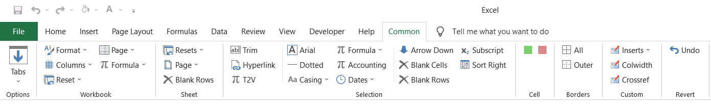
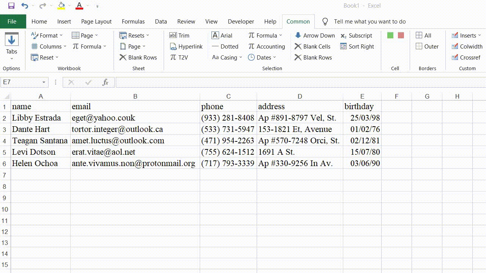

# Common Excel Addin
[Overview](#) · [Quickstart](#Quickstart) · [Features](#Features)

Common Excel Addin aims to provide commonly used formatting features in a single tab with customisable settings. 

## Quickstart[·]
- Download [Common Excel Addin v0.1.0](https://github.com/ry4nyeo/lab-vba/blob/main/excel/rel/commonaddin-r010.xlam)  
- Install the downloaded .xlam file. See [Excel guide] from Microsoft. 

## Features[·]

### Custom Functions[·]

|Functions|Description|
|:--|:--|
|[**XCOMPARE**](../excel/src/XCOMPARE.bas)|Returns the word difference between two ranges.|
|[**XEXTRACTAFTER**](../excel/src/XEXTRACTAFTER.bas)|Returns the part of a selected range after a specified word.|
|[**XEXTRACTBEFORE**](../excel/src/XEXTRACTBEFORE.bas)|Returns the part of a selected range before a specified word.|
|[**XFIND**](../excel/src/XFIND.bas)|Returns the word search results on a selected range based on a specified word list.|
|[**XHASNUMBER**](../excel/src/XHASNUMBER.bas)|Returns True if there is a number in the selected range.|
|[**XLOOKUP**](../excel/src/XLOOKUP.bas)|Returns the matched lookup value from a search list.|
|[**XREPLACEWORDS**](../excel/src/XREPLACEWORDS.bas)|Replaces words in a selected range based on specified replacement word list.|
|[**XSPELLNUMBER**](../excel/src/XSPELLNUMBER.bas)|Spells monetary values in dollar and cents.|
|[**XSUBSTITUTEPREFIX**](../excel/src/XSUBSTITUTEPREFIX.bas)|Replaces the prefix of a selected range based on a specified replacement.|
|[**XSUBSTITUTESUFFIX**](../excel/src/XSUBSTITUTESUFFIX.bas)|Replaces the suffix of a selected range based on a specified replacement.|
|[**XTRANSLATE**](../excel/src/XTRANSLATE.bas)|Returns the Google Translation result on a selected range.|
|[**XCELLFORMULA**](../excel/src/XCELLFORMULA.bas)|Returns formula of the selected cell.|
|[**XCLEANTEXT**](../excel/src/XCLEANTEXT.bas)|Removes excess non-alphanumeric characters|
|[**XGETPAGENUMBER**](../excel/src/XGETPAGENUMBER.bas)|Returns page number.|
|[**XIFDATE**](../excel/src/XIFDATE.bas)|Returns True if it is date format.|
|[**XREMOVEBETWEEN**](../excel/src/XREMOVEBETWEEN.bas)|Removes text between two specified delimiters.|
|[**XREMOVESYMBOLS**](../excel/src/XREMOVESYMBOLS.bas)|Removes leading and trailing symbols from text.|
|[**XSHEETNAME**](../excel/src/XSHEETNAME.bas)|Returns worksheet name.|
|[**XSUBSTITUTEMULTIPLE**](../excel/src/XSUBSTITUTEMULTIPLE.bas)|Substitutes multiple words.|

### Examples[·]

 

---
[Addins] > [Common Excel Addin]

[Addins]: https://github.com/ry4nyeo/lab-vba
[Common Excel Addin]: ../excel/pgs-commonaddin.md
[·]: #

[Excel guide]: https://support.microsoft.com/en-us/office/add-or-remove-add-ins-in-excel-0af570c4-5cf3-4fa9-9b88-403625a0b460#:~:text=COM%20add%2Din-,Click%20the%20File%20tab%2C%20click%20Options%2C%20and%20then%20click%20the,install%2C%20and%20then%20click%20OK.
